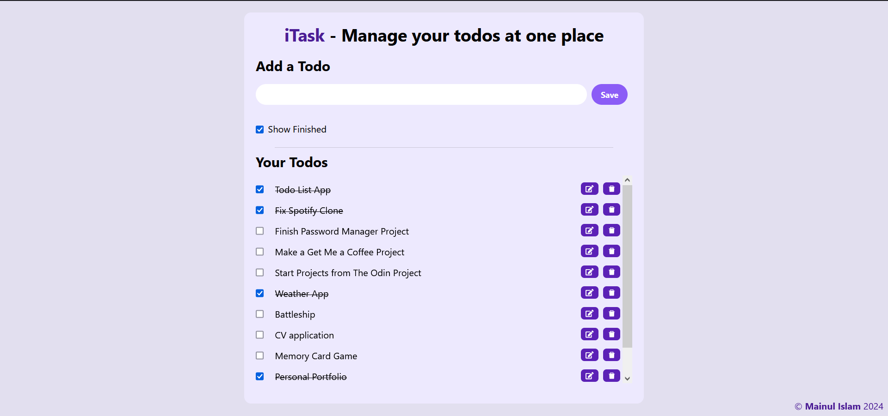

# Todo-React

A simple Todo List app using React and Tailwind.

## Table of contents

- [Overview](#overview)
    - [Requirement](#project-requirement)
    - [Solution Screenshot](#solution-screenshot)
    - [Links](#links)
- [Built with](#built-with)
- [Author](#author)

### Project-Requirement

A todo-list app where daily task cane be added, deleted, edited and check

### Solution Screenshot

The final output:

### Links

Live Site URL: [Live site of the challenge hosted here](https://mainul-islam-nirob.github.io/todo-react/)

### Built with

- HTML5
- Tailwind CSS
- React

## Author

- Website - Well I haven't made my profile portfolio yet, gonna make it sooon when I know a lot of stuffs
- LinkedIn - [@mainul islam](https://www.linkedin.com/in/mainul-islam-nirob/)
- Frontend Mentor - [@mainul](https://www.frontendmentor.io/profile/Mainul-Islam-Nirob)
- Twitter - [@mainul](https://twitter.com/Mainuli96601040)
- FreeCodeCamp - [@mainul](https://www.freecodecamp.org/mainul)
